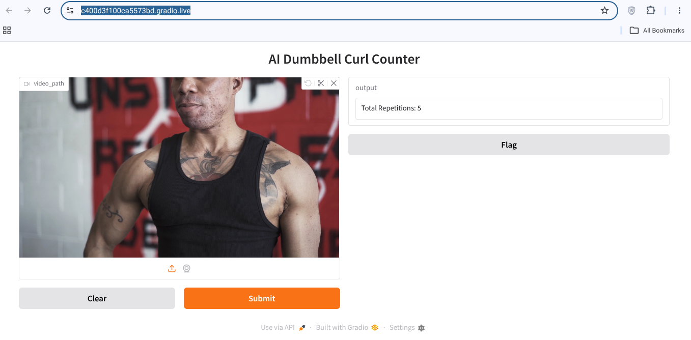

# Dumbbell Curl Counter AI

https://colab.research.google.com/drive/1jmHcyFYOoKhLEU_gmKhKSE2s5PWzZPOR#scrollTo=od1l1Iz9I08i

https://c400d3f100ca5573bd.gradio.live/


============

🏋️ AI Dumbbell Curl Counter

An AI-powered fitness application that automatically counts dumbbell curl repetitions
from uploaded workout videos using YOLO Pose Estimation, OpenCV, and Gradio.

---

Application Preview



---

Features

* ✅ Automatic dumbbell curl repetition counting
* ✅ YOLO11 Pose Estimation
* ✅ Elbow angle calculation
* ✅ Video upload support
* ✅ AI-based exercise analysis
* ✅ Gradio web interface
* ✅ Repetition report generation
* ✅ Frame-wise exercise tracking

---

🛠 Technologies Used

* Python
* OpenCV
* NumPy
* YOLO11 Pose (Ultralytics)
* Gradio
* Google Colab

---

📂 Project Structure


Dumbbell-Curl-Counter-AI/
│
├── app.py
├── requirements.txt
├── README.md
├── Dumbbell_Curl_Counter_AI.ipynb
│
├── images/
│   └── app.png
│
└── .gitignore
```

---

⚙️ How It Works


Workout Video
      ↓
YOLO Pose Detection
      ↓
Shoulder-Elbow-Wrist Keypoints
      ↓
Elbow Angle Calculation
      ↓
Repetition Detection
      ↓
Exercise Report

=====

Sample Output


DUMBBELL CURL REPORT
===============================

TOTAL REPETITIONS : 5
```

---

Use Case

This project can be used for:

* Fitness tracking
* Gym workout monitoring
* Home exercise analysis
* AI-powered fitness applications

---

